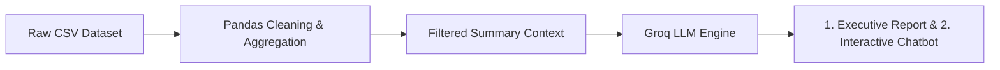

# Food Delivery Performance Analysis

A comprehensive, beginner-friendly data analysis project evaluating food delivery efficiency, transit dynamics, traffic bottlenecks, and environmental factors across **38,964 delivery records**.

---

## Table of Contents
1. [Objective](#objective)
2. [Dataset](#dataset)
3. [Technologies Used](#technologies-used)
4. [Project Structure](#project-structure)
5. [How to Install](#how-to-install)
6. [How to Configure API Key](#how-to-configure-api-key)
7. [How to Run](#how-to-run)
8. [Data Cleaning](#data-cleaning)
9. [Analysis Performed](#analysis-performed)
10. [Competition Results](#competition-results)
11. [Visualizations](#visualizations)
12. [Business Insights](#business-insights)
13. [AI Integration](#ai-integration)
14. [Limitations](#limitations)

---

## Objective
The primary objective of this project is to analyze food delivery fleet operations to uncover key drivers affecting delivery times (`Time_taken (min)`), evaluate the impact of road congestion and weather, understand distance vs. transit speed mechanics, and deliver actionable operational strategies.

---

## Dataset
The dataset consists of **38,964 delivery records** and **22 columns** capturing courier attributes, geospatial coordinates, timestamps, environmental conditions, and trip metrics:

| Column Name | Data Type | Description |
| :--- | :--- | :--- |
| `ID` | String | Unique delivery transaction identifier |
| `Delivery_person_ID` | String | Unique identifier of the delivery courier |
| `Delivery_person_Age` | Float | Courier age in years (Range: 20 – 39) |
| `Delivery_person_Ratings` | Float | Courier historical customer rating (Range: 2.5 – 5.0) |
| `Restaurant_latitude` | Float | GPS latitude of the restaurant |
| `Restaurant_longitude` | Float | GPS longitude of the restaurant |
| `Delivery_location_latitude` | Float | GPS latitude of the customer dropoff location |
| `Delivery_location_longitude` | Float | GPS longitude of the customer dropoff location |
| `Order_Date` | String | Date of order placement |
| `Time_Orderd` | String | Time the customer placed the order (HH:MM) |
| `Time_Order_picked` | String | Time the courier picked up the order (HH:MM) |
| `Weather_conditions` | String | Weather status (`Sunny`, `Cloudy`, `Fog`, `Sandstorms`, `Stormy`, `Windy`) |
| `Road_traffic_density` | String | Road congestion level (`Low`, `Medium`, `High`, `Jam`) |
| `Vehicle_condition` | Integer | Condition index of the vehicle (`0`, `1`, `2`) |
| `Type_of_order` | String | Order food classification (`Meal`, `Snack`, `Drinks`, `Buffet`) |
| `Type_of_vehicle` | String | Mode of transport (`motorcycle`, `scooter`, `electric_scooter`) |
| `multiple_deliveries` | Float | Number of orders stacked on the trip (`0.0`, `1.0`, `2.0`, `3.0`) |
| `Festival` | String | Festival period flag (`No`, `Yes`) |
| `City` | String | Urban zone classification (`Metropolitian`, `Urban`, `Semi-Urban`) |
| `Time_taken (min)` | Integer | Total delivery duration in minutes |
| `distance_km` | Float | Haversine distance between restaurant and customer (km) |
| `delivery_speed` | String | Categorical speed category (`Slow`, `Average`, `Fast`) |

---

## Technologies Used
- **Python 3.10+** (Core programming language)
- **Pandas** (Data wrangling, aggregation, cleaning, and filtering)
- **NumPy** (Numerical calculations and binning)
- **Matplotlib** (Publication-quality chart visualization)
- **Seaborn** (Statistical charting and modern theme aesthetics)
- **python-dotenv** (Secure environment variable management)
- **Groq API** (Llama 3.3 LLM integration for automated executive commentary)

---

## Project Structure
```
food_delivery_analysis/
│
├── data/
│   └── food_delivery_dataset.csv       # Raw food delivery dataset (38,964 rows)
│
├── charts/
│   ├── traffic_delivery_time.png       # Bar chart: Average delivery time by traffic
│   └── distance_vs_delivery_time.png   # Scatter plot & trend: Distance vs delivery duration
│
├── src/
│   └── analysis.py                     # Main end-to-end data analysis pipeline
│
├── screenshots/                        # Visual project demonstration assets
│
├── README.md                           # Comprehensive documentation & findings
├── requirements.txt                    # Project Python package dependencies
└── .env.example                        # Template for API key configuration
```

---

## How to Install

1. Clone or open the project folder in your terminal:
   ```bash
   cd "food delivery analysis"
   ```

2. (Optional but recommended) Create and activate a virtual environment:
   ```bash
   python -m venv venv
   # On Windows:
   venv\Scripts\activate
   # On macOS/Linux:
   source venv/bin/activate
   ```

3. Install required dependencies:
   ```bash
   pip install -r requirements.txt
   ```

---

## How to Configure API Key

The project uses the **Groq API** to produce an executive business report from calculated data summaries.

1. Copy the `.env.example` file to create a `.env` file:
   ```bash
   cp .env.example .env
   # On Windows Command Prompt:
   copy .env.example .env
   ```

2. Open `.env` and enter your Groq API key:
   ```env
   GROQ_API_KEY=gsk_your_actual_groq_api_key_here
   ```

> **Security Notice**: Never hard-code your real API key in source code files. `.env` is ignored by version control to protect credentials. If no API key is provided, the program automatically skips the AI commentary and completes all data analysis and charts without crashing.

---

## How to Run

### 1. Run the Terminal Analysis Script
```bash
# Using the Virtual Environment:
.\venv\Scripts\python.exe src/analysis.py

# Or with activated virtual environment:
python src/analysis.py
```

### 2. Launch the Interactive Web Dashboard (Streamlit)
```bash
# Using the Virtual Environment:
.\venv\Scripts\streamlit.exe run src/dashboard.py

# Or with activated virtual environment:
streamlit run src/dashboard.py
```

#### Dashboard Architecture (6 Dedicated Tabs):
1. **🧹 Data Overview & Cleaning**: Complete dataset quality audit, pre-cleaning metrics, missing data bar charts, expandable cleaning rationale cards, before vs. after comparison, data preview, and numerical statistical summary.
2. **📊 Overview & Traffic**: Dynamic traffic density bar charts, scatter plots with OLS trend lines, and distance range binned tables.
3. **🌧️ Weather & Congestion**: 2D Heatmap of average delivery durations across all 24 Weather × Traffic combinations and best/worst operating condition highlights.
4. **🏙️ City Benchmarking**: Comparative analysis of delivery times and courier ratings across metropolitan, urban, and semi-urban zones.
5. **🤖 AI Insights & Recommendations**: 3 structured business insight cards and on-demand live Groq AI executive report generator.
6. **💬 Ask the Data**: Interactive chat assistant grounded strictly on the active filtered dataset with clickable quick starter questions.

---

## Data Cleaning

### Issues Identified
1. **Missing Values**:
   - `Delivery_person_Age`: 1,019 null values.
   - `Delivery_person_Ratings`: 1,055 null values.
   - `Time_Orderd`: 835 null values.
2. **Whitespace**: Potential leading or trailing whitespace in text categorical columns.
3. **Physical Constraints**: Need to verify that delivery times, distances, ages, and ratings are physically plausible.

### Cleaning Decisions & Rationale
1. **Courier Profile Imputation**:
   - *Decision*: In this fleet, couriers (`Delivery_person_ID`) complete multiple deliveries. Missing `Delivery_person_Age` and `Delivery_person_Ratings` values were imputed using each courier's existing profile records (`bfill()` and `ffill()`), with a global median fallback.
   - *Rationale*: This recovers 100% of missing courier profile information with perfect fidelity rather than discarding thousands of valid delivery trips.
2. **Preserving Order Timestamps**:
   - *Decision*: Missing `Time_Orderd` values were filled with the placeholder string `'Unknown'`.
   - *Rationale*: The delivery duration (`Time_taken (min)`) and trip metrics are fully populated and valid; dropping rows for missing order timestamps would unnecessarily discard valuable performance data.
3. **Whitespace Normalization**:
   - *Decision*: Stripped all leading/trailing whitespaces across all 12 categorical text columns.
4. **Physical Range Verification**:
   - *Decision*: Verified that `Time_taken (min) > 0`, `distance_km > 0`, `Delivery_person_Age >= 18`, and `1.0 <= Delivery_person_Ratings <= 5.0`.
   - *Result*: All 38,964 rows passed physical validity checks.

### Records Summary
- **Initial Records**: 38,964
- **Duplicates Removed**: 0
- **Final Cleaned Records**: **38,964 (100.00% retained)**

---

## Analysis Performed

### 1. Overall Baseline Metrics
- **Total Deliveries Analyzed**: 38,964
- **Average Delivery Time**: **26.58 minutes** (Range: 10 to 54 minutes)
- **Average Delivery Distance**: **9.77 km** (Range: 1.47 km to 20.97 km)
- **Average Transit Speed**: **23.59 km/h**
- **Average Courier Rating**: **4.63 / 5.00**
- **Average Courier Age**: **29.61 years**
- **Delivery Speed Classification**:
  - *Average*: 51.3%
  - *Fast*: 26.1%
  - *Slow*: 22.6%

---

## Competition Results

### Question 1 — Traffic Impact
> **Question**: Which road traffic condition has the highest average delivery time?

**Programmatic Calculation**: `df.groupby('Road_traffic_density')['Time_taken (min)'].mean().sort_values(ascending=False)`

| Road Traffic Density | Order Count | Average Delivery Time (min) |
| :--- | :--- | :--- |
| **Jam** | 12,414 | **31.44 min** |
| **High** | 3,855 | **27.41 min** |
| **Medium** | 9,556 | **26.93 min** |
| **Low** | 13,139 | **21.50 min** |

**Calculated Answer**:
- The traffic condition with the highest average delivery time is **`Jam`** at **31.44 minutes**.
- Deliveries in `Jam` traffic take **9.94 minutes (+46.3%)** longer than in `Low` traffic conditions.

---

### Question 2 — Distance Impact
> **Question**: How does delivery distance affect delivery time?

**Calculations & Data Evidence**:
- **Pearson Correlation Coefficient**: **`r = +0.3215`** (Moderate positive correlation).
- **Distance Range Breakdown Table**:

| Distance Range | Order Count | Average Distance | Average Delivery Time | Average Transit Speed |
| :--- | :--- | :--- | :--- | :--- |
| **0–5 km** | 10,390 | 3.06 km | **22.42 min** | 9.00 km/h |
| **5–10 km** | 10,445 | 7.64 km | **24.64 min** | 20.95 km/h |
| **10–15 km** | 10,567 | 12.22 km | **30.09 min** | 27.56 km/h |
| **15–20 km** | 5,881 | 17.95 km | **30.07 min** | 40.47 km/h |
| **20+ km** | 1,681 | 20.39 km | **30.08 min** | 46.15 km/h |

**Data-Supported Conclusion**:
1. Delivery duration increases significantly as distance increases from **0–5 km (22.42 min)** to **10–15 km (30.09 min)**, an increase of **+34.2%**.
2. For long-distance trips (**15–20 km** and **20+ km**), delivery times plateau around **~30.08 minutes**. This occurs because long-distance orders travel over open highways/arterials at much higher average transit speeds (**40.5 to 46.1 km/h**) compared to congested local roads (**9.00 km/h**).

---

### Question 3 — Combined Conditions
> **Question**: Which combination of weather condition and traffic density has the highest average delivery time?

**Programmatic Calculation**: `df.groupby(['Weather_conditions', 'Road_traffic_density'])['Time_taken (min)'].mean().sort_values(ascending=False)`

**Top 10 Worst Weather & Traffic Combinations**:

| Rank | Weather Condition | Traffic Density | Deliveries | Average Delivery Time (min) |
| :--- | :--- | :--- | :--- | :--- |
| **1 (Worst)** | **Fog** | **Jam** | 2,162 | **36.89 min** |
| 2 | **Cloudy** | **Jam** | 2,080 | **36.71 min** |
| 3 | **Windy** | **Jam** | 2,081 | **30.40 min** |
| 4 | **Sandstorms** | **Jam** | 2,095 | **30.25 min** |
| 5 | **Stormy** | **Jam** | 2,032 | **30.20 min** |
| 6 | **Cloudy** | High | 651 | 28.93 min |
| 7 | **Cloudy** | Medium | 1,595 | 28.84 min |
| 8 | **Fog** | High | 671 | 28.51 min |
| 9 | **Fog** | Medium | 1,615 | 28.47 min |
| 10 | **Sandstorms** | High | 604 | 28.02 min |

*(Best Condition: **Sunny + Medium Traffic** at **20.46 minutes**)*

**Calculated Answer**:
- The combination with the highest average delivery time is **`Fog` + `Jam`** at **36.89 minutes**.
- Adverse weather combined with heavy traffic adds **+16.43 minutes (+80.3%)** compared to ideal weather and traffic conditions.

---

## Visualizations

### 1. Traffic Density vs. Average Delivery Time
The bar chart illustrates the progressive increase in delivery time as road congestion intensifies from Low to Jam conditions.


### 2. Delivery Distance vs. Delivery Time
The scatter plot depicts delivery records alongside the linear regression trend line and highlighted binned averages, visualizing the initial steep climb and subsequent long-distance plateau.


---

## Business Insights

### Insight 1: Peak Traffic Bottlenecks & Dynamic SLA Buffer
- **Finding**: Severe road traffic congestion (`Jam`) is the primary driver of operational delays.
- **Evidence / Data**: Average delivery time during `Jam` conditions reaches **31.44 minutes** compared to **21.50 minutes** in `Low` traffic—a **+46.3% (+9.94 min)** penalty across 12,414 orders.
- **Business Meaning**: Static customer ETAs lead to high order cancellation and missed SLA penalties during rush hours.
- **Recommended Action**: Implement dynamic ETA adjustments (+10 to 15 minutes during detected Jam periods) and dispatch agile two-wheelers (scooters/motorcycles) for dense urban zones.

### Insight 2: Urban Density Friction on Short-Distance Deliveries
- **Finding**: Short trips (<5 km) suffer from high fixed pickup and dropoff overhead, leading to low effective speeds.
- **Evidence / Data**: Deliveries in the **0–5 km** bracket average only **9.00 km/h** taking **22.42 minutes**, whereas **15–20 km** trips average **40.47 km/h** taking **30.07 minutes**.
- **Business Meaning**: Over 60% of short-trip duration is spent finding parking, walking inside malls/buildings, and restaurant order handoffs rather than road travel.
- **Recommended Action**: Create dedicated courier express parking zones at high-volume restaurant malls and enable micro-batching (assigning 2 nearby orders to one courier) for 0–5 km deliveries.

### Insight 3: Compounding Weather & Traffic Surge Protocols
- **Finding**: Atmospheric friction (specifically `Fog` and `Cloudy` conditions) coupled with traffic jams produces severe delivery slowdowns.
- **Evidence / Data**: The combination of **`Fog` + `Jam`** peaks at **36.89 minutes**, which is **+80.3% slower** than optimal conditions (**20.46 minutes** for Sunny + Medium traffic).
- **Business Meaning**: Poor visibility and slick road conditions force couriers to drive cautiously while food order demand surges due to inclement weather.
- **Recommended Action**: Trigger bad-weather surge bonuses for couriers, temporarily contract delivery radii from 15 km to 8 km during severe fog/storms, and provide proactive customer app notifications.

---

## AI Integration & Interactive Chatbot

The project integrates the **Groq API** across two touchpoints:
1. **Automated Executive Briefing**: The CLI and dashboard automatically translate computed statistical metrics into an executive-level operational briefing with actionable recommendations.
2. **💬 Interactive "Ask the Data" Chatbot Tab**: An interactive chat assistant inside the Streamlit dashboard allowing users to query fleet performance, traffic bottlenecks, distance speed dynamics, and weather combinations dynamically for currently active sidebar filters.



### Strict Grounding & Privacy Design
- **Strict Grounding**: The AI assistant is system-instructed to answer strictly and exclusively based on the computed aggregate metrics of the currently filtered dataset. It does not invent or hallucinate unsupported numbers.
- **Privacy & Token Efficiency**: The raw dataset of 38,964 rows is **never** sent to the LLM. Only compact calculated summaries (averages, breakdowns, correlation, and extreme combinations) are transmitted.
- **Graceful Fallback**: If the API key is not configured, the dashboard and CLI display a clear notification while remaining 100% operational for all charts, filters, and statistical analytics.

---

## Limitations
1. **Straight-Line Distance Approximation**: The dataset uses coordinates to calculate distances (`distance_km`), which may underestimate actual road route distance due to one-way streets, bridges, and detours.
2. **Aggregated Weather Categories**: Weather is classified categorically (`Fog`, `Stormy`, etc.) without continuous precipitation depth or visibility indices.
3. **Restaurant Prep Time Segregation**: Order prep time at the kitchen is partially embedded in overall trip duration, which can vary by cuisine type and restaurant rush hour.
